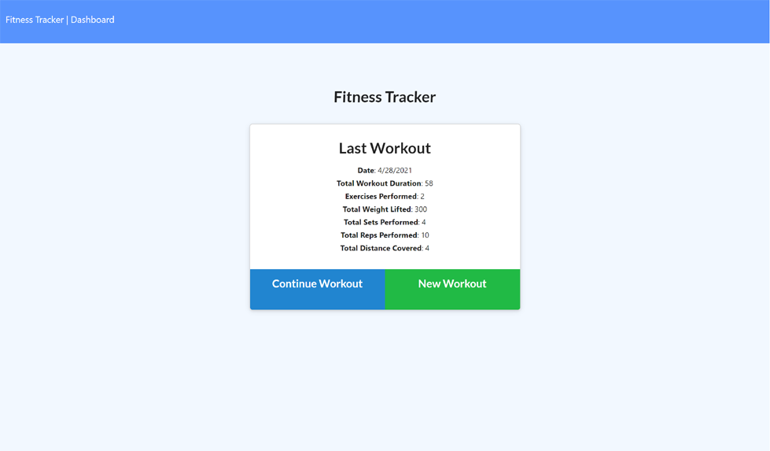
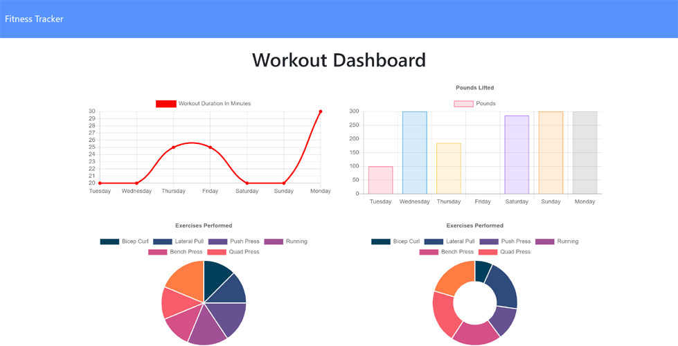

# Workout-Tracker

## Description

An application that utilizes a noSQL database to store, update, and graphically display a user's workouts.

## Table of Contents

- [Technolgies](#Technologies-Utilized)
- [Usage](#usage)
- [Credits](#credits)
- [License](#license)

## Technologies-Utilized

- [JavaScript](https://developer.mozilla.org/en-US/docs/Web/JavaScript)
- [Node.js](https://nodejs.org/en/)
- [express](https://expressjs.com/)
- [mongoDB](https://www.mongodb.com/2)
- [mongoose](https://mongoosejs.com/)

## Usage

- A user can perform the following

  - Add exercises to the most recent workout plan.
  - Add new exercises to a new workout plan.
  - View the combined weight of multiple exercises from the past seven workouts on the `stats` page.
  - View the total duration of each workout from the past seven workouts on the `stats` page.

## Deployed Application Link

- [Deployed Link](https://fitness-tracker-bah.herokuapp.com)

- Screenshots of the application:

## Credits

- [bahuisken](https://github.com/bahuisken/)
- Lessons from University of Denver Fullstack Coding Bootcamp

## License

None

## Contributing

[Contributor Covenant](https://www.contributor-covenant.org/)

## Tests

N/A

## Questions

If you have any questions about the repo, open an issue or contact me directly at [brice.huisken@gmail.com](mailto:brice.huisken@gmail.com). You can find more of my work at [bahuisken](https://github.com/bahuisken/)
